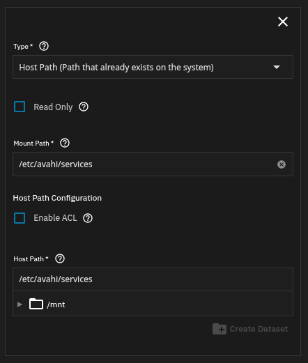

# HomeKit Avahi Proxy

A Home Assistant custom component for aiding HomeKit Bridge discovery within TrueNAS or other network-restricted environments by translating the HomeKit Bridge Zeroconf entries into Avahi service files and placing them into the (mounted) services directory.

The integration listens for the addition, update, and removal of HomeKit Bridge instances and acts accordingly. Only active (i.e. enabled) Bridges are added.

## Preparation (for TrueNAS)

1. Make sure mDNS is enabled in System → Network → Network Configuration → Settings.
2. Edit the Home Assistant app.
3. In `Storage Configuration → Additional Storage`, add a new bind mount for /etc/avahi/services. `Mount path` can be arbitrary, but will need to be matched during integration setup.

> [!IMPORTANT]
> Don't forget that you'll also need to open a port for all HomeKit Bridge instances. The ports can most easily be checked in `Settings → System → Network → Zeroconf browser`. It's usually 21063 and up. 

> [!NOTE]
> You don't need to set `advertise_ip` in HomeKit Bridge since the IP field gets discarded during conversion and gets replaced by Avahi on TrueNAS. 

## Preparation (generic)

Make sure to mount the Avahi services folder of the host (usually `/etc/avahi/services`) into the VM or container with the correct permissions (has to be writable).

## Installation

### HACS (Recommended)

1. Add this repository to HACS as a custom repository
2. Search for "HomeKit Bridge Avahi Proxy" in HACS
3. Click Install
4. Restart Home Assistant

### Manual

1. Copy the `custom_components/homekit_bridge_proxy` directory to your Home Assistant's `custom_components` directory
2. Restart Home Assistant

## Configuration

1. Go to Settings → Devices & Services
2. Click "+ Add Integration"
3. Search for "HomeKit Avahi Proxy"
4. Enter the target path when prompted
